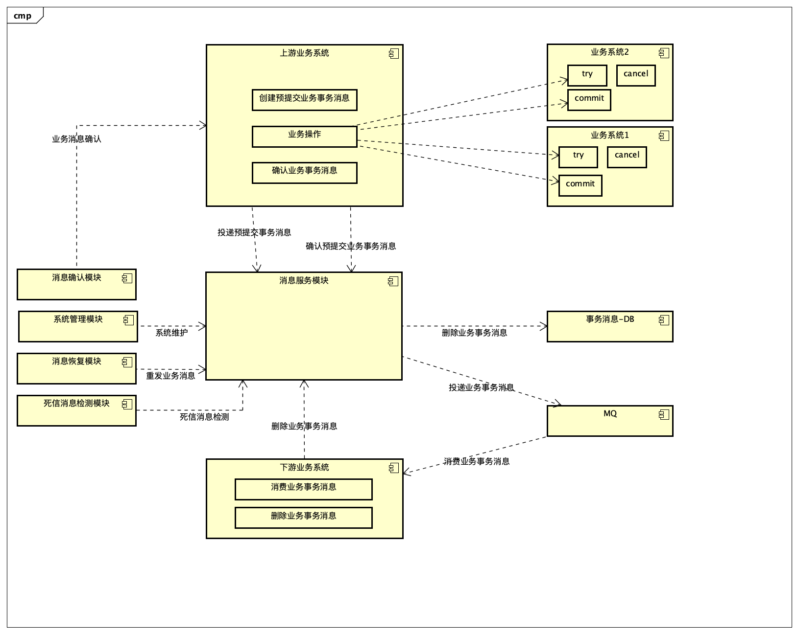

------------

## 介绍

**reliable-message**是基于可靠消息的**最终一致性**的分布式事务解决方案（需要MQ），同时也提供了Tcc事务模型解决方案，基于事务消息半提交原理，结合消息的回查机制（不依赖MQ的情况）。

- RMQ不同于seata、tcc-transaction、Hmily等类似框架。RMQ给予用户最灵活的选择，不局限于dubbo、spring
  cloud，对方接口可以是grpc、thrift、http等类似接口。只要业务方接口提供类似Try、Commit、Cancel接口，或Commit、Cancel接口。我们在业务层面通过硬编码的形式实现类型TCC或CC的效果。

## 框架定位

- RMQ本身不生产消息队列，只是消息的搬运工。
- RMQ框架提供消息预发送、消息发送、消息确认、消息恢复、消息管理等功能，结合成熟的消息中间件（Kafka、RocketMQ），解决分布式事务，达到数据最终一致性。
- RMQ基于事务消息半提交原理，结合消息的回查机制，实现类似TCC的事务模型（业务硬编码）。

## 系统架构


| 角色 | 描述 |
| --- | --- |
| 消息确认模块 | 对于长时间未被确认的业务消息，与上游系统确认是否需要发送业务消息 |
| 上游业务系统 | 根据消息确认模块回查的业务消息，判断业务是否完成，如果完成告诉消息确认模块已处理成功，如果失败回滚上游业务系统资源，告诉消息确认模块业务处理失败，可以删除消息 |
| 下游业务系统 | 消费MQ数据，完成业务处理成功后，删除业务消息 |
| 系统管理模块 | 消息可视化管理后台，消息队列配置、消息查看、重发、删除等 |
| 消息恢复模块 | 对于长时间未消费的业务消息，重新发送业务消息给下层业务系统 |
| 死信消息检测模块 | 对于重发次数达到一定值的业务消息标记未死亡消息，不在被发送，转人工重发处理或者删除 |
| 消息服务模块 | 暴露服务的服务提供方，业务服务实现（预发送业务消息、确认发送业务消息、删除业务消息等） |
| MQ | 提供消息队列功能，Kafka、RocketMQ等|


------------

## Maven模块描述

| 模块名称 | 描述 |
| --- | --- |
| rmq-api | 提供业务系统调用的RMQ服务接口 |
| rmq-service-api | 基础消息服务接口、系统工具类、实体类封装 |
| rmq-service | RMQ服务接口实现、基础消息服务接口实现、消息管理子系统服务接口实现 |
| rmq-schedule-api | 消息确认模块、消息恢复模块、死信消息检测模块服务接口 |
| rmq-schedule | 消息确认模块，与上游业务系统确认消息是否发送<br>消息恢复模块，重新发送消息给下游业务 |
| rmq-admin-api | 系统管理模块服务接口、实体类封装 |
| rmq-admin | 系统管理模块，提供消息管理后台 |
| rmq-storage | 消息持久化层|

------------

## 在业务代码中引入RMQ的Dubbo服务

```
import org.apache.dubbo.config.annotation.DubboReference;
import com.damon.rmq.api.service.IReliableMessageService;

@DubboReference
private IReliableMessageService reliableMessageService;
```

## 编写消息发送方业务方法

结合事务消息实现TCC效果，如果不需要使用MQ传递领域消息到其他业务模块，可以在完成业务后删除事务消息，不需要confirm它。

- 案例1

```
public void doBusiness() {
        // 自定义消息队列名称
        String queue = "test_queue";
        // 消息内容, 如果传输对象，建议转换成json字符串
        String messageContent = "......";
        // 调用RMQ，预发送消息
        String messageId = reliableMessageService.createPreMessage(queue, messageContent);

        try{
          //以下步骤可以异步多线程执行
          //执行业务1 Try(业务层面需要做好幂等、悬挂)
          //执行业务2 Try(业务层面需要做好幂等、悬挂)
          //执行业务3 Commit(业务层面需要做好幂等、悬挂)    
        }catch(Throwable e){
         RpcContext.getContext().asyncCall(() -> 
            // 回滚业务1 Cancel(业务层面需要做好幂等、悬挂、空回滚问题)
            // 回滚业务2 Cancel(业务层面需要做好幂等、悬挂、空回滚问题)
            // 执行业务3 Cancel(业务层面需要做好幂等、悬挂、空回滚问题)
            // 删除预发送消息
            reliableMessageService.deleteMessage(queue, messageId)
         );
         return;
        }
        RpcContext.getContext().asyncCall(() -> 
          //执行业务1 Commit(业务层面需要做好幂等、悬挂)
          //执行业务2 Commit(业务层面需要做好幂等、悬挂)    
          //异步调用RMQ，确认发送消息(如果是当做分布式事务框架使用，不需要对外发送消息，则不需要进行消息confirm操作，直接调用deleteMessage删除事务消息即可)
          reliableMessageService.confirmAndSendMessage(queue, messageId);
        );
    }
```

## 案例1编写消息消费方业务方法（RocketMQ）

```
@Component
@Slf4j
public class PayQueueRocketmqConsumer {

    @DubboReference
    private IRechargeOrderService rechargeOrderService;
    @DubboReference
    private IReliableMessageService reliableMessageService;

    @PostConstruct
    public void handler() throws MQClientException {
        DefaultMQPushConsumer consumer = new DefaultMQPushConsumer("pay_queue_consumer_group");
        consumer.setNamesrvAddr("localhost:9876");
        consumer.setConsumeFromWhere(ConsumeFromWhere.CONSUME_FROM_LAST_OFFSET);
        consumer.setConsumeThreadMax(1);
        consumer.setConsumeThreadMin(1);
        consumer.setMaxReconsumeTimes(1);
        consumer.subscribe("pay_queue", "*");
        consumer.registerMessageListener(new MessageListenerConcurrently() {

            @Override
            public ConsumeConcurrentlyStatus consumeMessage(List<MessageExt> msgs, ConsumeConcurrentlyContext context) {
                try {
                    System.out.printf("%s Receive New Messages: %s %n", Thread.currentThread().getName(), msgs);
                    for (MessageExt message : msgs) {
                        String body = new String(message.getBody(), Charset.forName("UTF-8"));
                        TransactionMessage msg = JSONUtil.toBean(body, TransactionMessage.class);
                        log.info("【payQueue】开始处理消息" + msg);
                        PayOrder payOrder = JSONUtil.toBean(msg.getMessageBody(), PayOrder.class);
                        rechargeOrderService.rechargeSuccess(payOrder);
                        reliableMessageService.deleteMessage(message.getTopic(), msg.getMessageId());
                        log.info("【payQueue】处理消息成功");
                    }
                    return ConsumeConcurrentlyStatus.CONSUME_SUCCESS;
                } catch (Throwable e) {
                    log.info("【payQueue】处理消息失败", e);
                    return ConsumeConcurrentlyStatus.RECONSUME_LATER;
                }

            }
        });
        consumer.start();
        System.out.printf("pay queue consumer started.");
    }
}
        
```

## 案例1编写消息消费方业务方法（Kafka）

```
@Component
@Slf4j
@Configuration
public class PayQueueKafkaConsumer {

    @Bean
    public ConcurrentKafkaListenerContainerFactory<String, String> kafkaListenerContainerFactory() {
        ConcurrentKafkaListenerContainerFactory<String, String> factory =
            new ConcurrentKafkaListenerContainerFactory<String, String>();
        factory.setConsumerFactory(consumerFactory());
        return factory;
    }

    @Bean
    public ConsumerFactory<String, String> consumerFactory() {
        return new DefaultKafkaConsumerFactory<String, String>(consumerConfigs());
    }

    @Bean
    public Map<String, Object> consumerConfigs() {
        HashMap<String, Object> props = new HashMap<String, Object>();
        props.put("bootstrap.servers", "localhost:9092");
        props.put("group.id", "pay_queue_consumer_group");
        props.put("enable.auto.commit", "true");
        props.put("auto.commit.interval.ms", "1000");
        props.put("key.deserializer", "org.apache.kafka.common.serialization.StringDeserializer");
        props.put("value.deserializer", "org.apache.kafka.common.serialization.StringDeserializer");
        return props;
    }

    @DubboReference
    private IRechargeOrderService rechargeOrderService;
    @DubboReference
    private IReliableMessageService reliableMessageService;

    @KafkaListener(id = "pay", topics = "pay_queue")
    public void listen(ConsumerRecord<String, String> record) {
        String body = record.value();
        TransactionMessage msg = JSONUtil.toBean(body, TransactionMessage.class);
        log.info("【payQueue】开始处理消息" + msg);
        PayOrder payOrder = JSONUtil.toBean(msg.getMessageBody(), PayOrder.class);
        rechargeOrderService.rechargeSuccess(payOrder);
        reliableMessageService.deleteMessage("pay_queue", msg.getMessageId());
        log.info("【payQueue】处理消息成功");
    }

}
        
```

- 案例2

```
public void doBusiness() {
        // 自定义消息队列名称
        String queue = "test_queue";
        // 消息内容, 如果传输对象，建议转换成json字符串
        String messageContent = "......";
        // 调用RMQ，预发送消息
        String messageId = reliableMessageService.createPreMessage(queue, messageContent);

        try{
         
         // 执行业务1 Try(业务层面需要做好幂等、悬挂)
         // 执行业务2 Try(业务层面需要做好幂等、悬挂)
         // 执行业务3 Commit(业务层面需要做好幂等、悬挂)    
        }catch(Throwable e){
         // 回滚业务1 Cancel(业务层面需要做好幂等、悬挂、空回滚问题)	                     
         // 回滚业务2 Cancel(业务层面需要做好幂等、悬挂、空回滚问题)                      
         // 执行业务3 Cancel(业务层面需要做好幂等、悬挂、空回滚问题)
         RpcContext.getContext().asyncCall(() -> reliableMessageService.deleteMessage(queue, messageId));
         return;
        } 
        // 异步调用RMQ，确认发送消息(如果是当做分布式事务框架使用，不需要对外发送消息，则不需要进行消息confirm操作，直接调用deleteMessage删除事务消息即可)
        RpcContext.getContext().asyncCall(() -> reliableMessageService.confirmAndSendMessage(queue, messageId));
    }
```

## 案例2消息消费方业务方法，（RocketMQ）

```
@Component
@Slf4j
public class PayQueueRocketmqConsumer {

    @DubboReference
    private IRechargeOrderService rechargeOrderService;
    @DubboReference
    private IReliableMessageService reliableMessageService;

    @PostConstruct
    public void handler() throws MQClientException {
        DefaultMQPushConsumer consumer = new DefaultMQPushConsumer("pay_queue_consumer_group");
        consumer.setNamesrvAddr("localhost:9876");
        consumer.setConsumeFromWhere(ConsumeFromWhere.CONSUME_FROM_LAST_OFFSET);
        consumer.setConsumeThreadMax(1);
        consumer.setConsumeThreadMin(1);
        consumer.setMaxReconsumeTimes(1);
        consumer.subscribe("pay_queue", "*");
        consumer.registerMessageListener(new MessageListenerConcurrently() {

            @Override
            public ConsumeConcurrentlyStatus consumeMessage(List<MessageExt> msgs, ConsumeConcurrentlyContext context) {
                try {
                    System.out.printf("%s Receive New Messages: %s %n", Thread.currentThread().getName(), msgs);
                    for (MessageExt message : msgs) {
                       
                        String body = new String(message.getBody(), Charset.forName("UTF-8"));
                        TransactionMessage msg = JSONUtil.toBean(body, TransactionMessage.class);
                        
                        log.info("【payQueue】开始处理消息" + msg);
                        PayOrderCancel cancel = JSONUtil.toBean(msg.getMessageBody(), PayOrderCancel.class);
                        // 执行业务1 Commit(业务层面需要做好幂等、悬挂)
                        // 执行业务2 Commit(业务层面需要做好幂等、悬挂)   
                        //处理下游业务
                        rechargeOrderService.rechargeSuccess(payOrder);
                        //删除rmq消息
                        reliableMessageService.deleteMessage(message.getTopic(), msg.getMessageId());
                        
                        log.info("【payQueue】处理消息成功");
                    }
                    return ConsumeConcurrentlyStatus.CONSUME_SUCCESS;
                } catch (Throwable e) {
                    log.info("【payQueue】处理消息失败", e);
                    return ConsumeConcurrentlyStatus.RECONSUME_LATER;
                }

            }
        });
        consumer.start();
        System.out.printf("pay queue consumer started.");
    }
}
        
```

## 编写业务回调check方法

当执行doBusiness异常回滚业务时或业务在Commit时，系统奔溃，消息确认子系统定时发起消息确认

```
@RequestMapping("check")
@ResponseBody
public CheckStatus checkBusStatus(BusReq req) {
   
   //如果业务执行成功 
   //return new CheckStats(0,1||2)
   
   
   //如果业务执行失败
   //回滚业务1 Cancel(业务层面需要做好幂等、悬挂、空回滚问题)
   //回滚业务2 Cancel(业务层面需要做好幂等、悬挂、空回滚问题)
   //执行业务3 Cancel(业务层面需要做好幂等、悬挂、空回滚问题)
   //return new CheckStats(0,0)
   
}

CheckStatus 格式
{	
  "code": 0,  // 0 成功  1 失败 
  "data": 1   // 0 业务处理失败，删除半提交消息 1 业务处理成功，RMQ发送半消息到MQ中间件 2 业务处理成功，RMQ删除半提交消息 
}

```

### 为什么会有3种状态？

- 0 业务没有处理成功，回滚完所有业务后，半提交消息需要删除。
- 1 业务处理成功了，只是刚好在消息confirm时系统宕机了，此时消息确认子系统check业务系统后需要重新发送。
- 2 不需要传递领域消息到其他业务模块，业务已经完成了，需要删除了（虽然和0状态码效果是一样的，还是区分开来好一点）。

## 业务接口注意事项

- 幂等性：不管是MQ消费服务，还是业务提供的Try、Commit、Cancel接口都需要满足幂等性要求，因为极端异常情况下，消息确认子系统会check业务系统做数据一致性修正。存在重复调用的情况，也存在消息重复发送MQ的情况。
- 空回滚：业务系统有可能没执行Try，结果被执行Cancle的情况。需要保障不允许空回滚的情况。
- 悬挂：由于网络问题业务先被Cancel了然，后又收到Try的动作。需要保证Try不会被执行。

基于以上三个问题是分布式事务中一定会遇到的：可以引入一个**业务幂等表**来解决消息的幂等性、空回滚、悬挂问题。

------------

